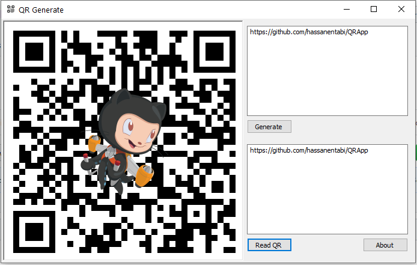

# QR Application :bowtie:
**Create a QR Code With a Custom Logo Inside in c#**
---
Screenshot :  

 

## information 
1. Editor Visual studio 2015
1. Language C sharp 

**library ZXing.Net**
--- 
ZXing.Net is a port of ZXing, an open-source, multi-format 1D/2D barcode image processing library originally implemented in Java.
It has been ported by hand with a lot of optimizations and improvements.
 
[github ZXing.Net] (https://github.com/micjahn/ZXing.Net)
 
[nuget ZXing.Net] (https://www.nuget.org/packages/ZXing.Net/0.16.2)
